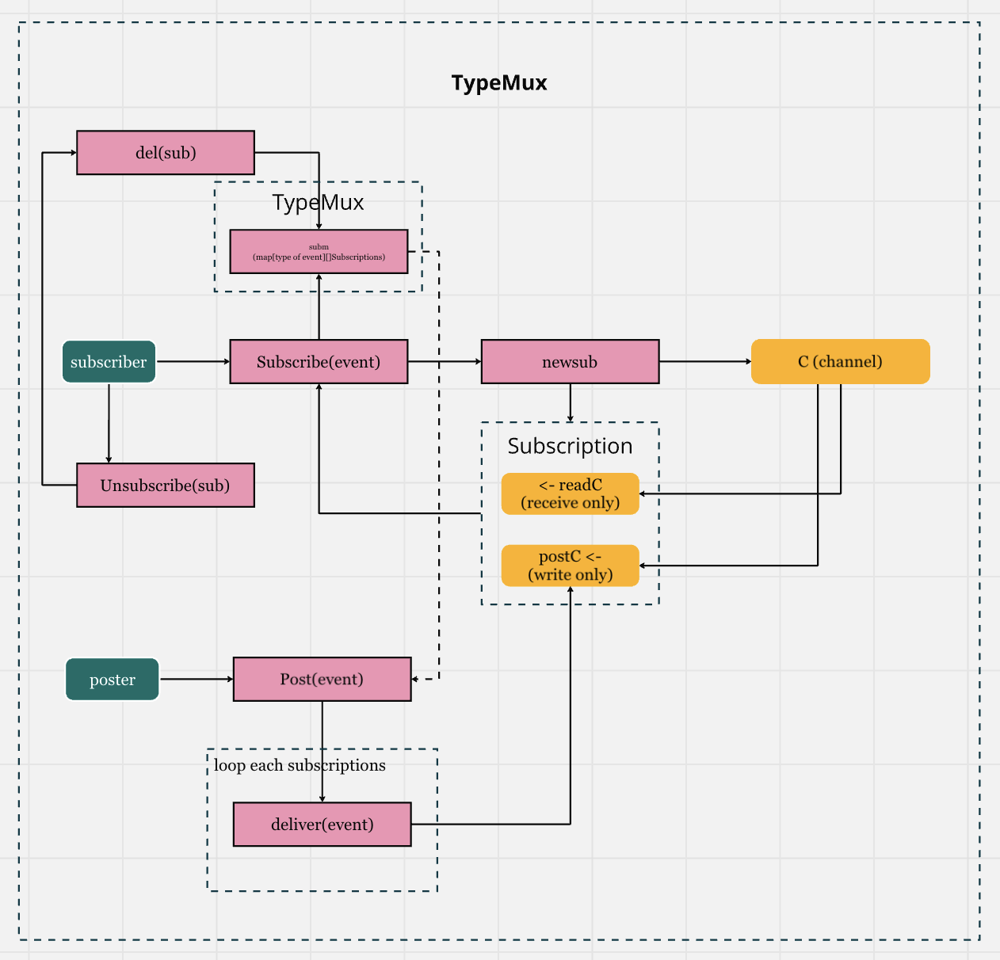

# TypeMux Pattern
The `TypeMux` pattern in Geth is an event-driven mechanism designed to manage and dispatch messages based on their types. This pattern enables different components within Geth to subscribe to specific message types and receive only the events that are relevant to them.

## How to run test
```bash
$ go test -v
```

## Overview


### Purpose
`TypeMux` provides a way for components in Geth to register interest in specific types of events without tight coupling between event producers and consumers. By subscribing to only relevant message types, each component can handle events independently and avoid unnecessary processing.

### Core Components
- `TypeMux`: The main structure that holds a registry of event subscribers, mapping each message type to the respective subscriptions.
- `TypeMuxSubscription`: Represents a subscription to a particular type of message, allowing a subscriber to receive events of that type through a dedicated channel.
- `Subscribe` & `Post` Methods: Subscribers use `Subscribe` to register for specific message types, while `Post` allows messages to be sent to all relevant subscribers.

### How It Works:
- When a message is posted via Post, typemux determines the message’s type and routes it to all channels subscribed to that type.

### Why this pattern is deprecated ?
While `typemux` has some flexibility, it poses several limitations and issues compared to Feed, making it less suitable for Geth’s high-performance requirements. Here’s a breakdown of the cons of using `typemux` versus `Feed`:

1. Type Safety and Error Handling
- Lack of Type Safety: `typemux` relies on reflection to handle multiple event types, which weakens type safety. With `typemux`, errors due to type mismatches only show up at runtime, making it harder to catch these issues during development.
- Uncontrolled Panics: Because `typemux` doesn’t enforce type constraints, it can lead to runtime panics when the types don’t match the expected inputs. In contrast, `Feed` provides early type validation during subscription, allowing it to prevent panics by enforcing type consistency upfront.
2. Performance Overhead
- Heavy Reflection Usage: `typemux` depends on reflection to handle type checks and event routing. This approach is inherently slower and less efficient, especially under high-frequency events, as reflection adds significant processing overhead.
- Increased Goroutine Usage: Since `typemux` has fewer mechanisms to manage inactive subscribers, it can easily spawn excessive goroutines that linger if not managed carefully. This overhead accumulates over time, especially in long-running applications, consuming unnecessary memory and CPU resources.
3. Scalability and Complexity
- Complicated Type Routing: `typemux` has a more complex system for routing multiple event types, which becomes unwieldy as the number of types increases. This complexity makes the code harder to maintain and scale efficiently, especially in high-load applications like Geth.
- Difficult Subscription Management: Managing subscriptions in `typemux` is more challenging because it does not provide granular control over the subscription lifecycle. Unsubscribing channels can become difficult to manage, potentially leading to resource leaks over time.
4. Limited Control over Event Flow
- Inconsistent Event Delivery: `typemux` does not guarantee that subscribers receive events in a predictable order or manner. For event-driven applications requiring reliable delivery, this inconsistency can be problematic.
- Latency in Event Handling: The reflection-based approach adds delays to event dispatching, especially under heavy workloads. This latency can impact performance and responsiveness, which is critical in a blockchain environment like Geth.
5. Benchmark

    This benchmark run on Viction. 
    - `Feed`: 

        
    - `TypeMux`:

        

    Comparison:
    - Number of Iterations:
        The second benchmark (`benchmarkFeedSend1000-8`) executed more iterations (19,892) than the first benchmark (`benchmarkPost1000-8`), which executed 14,420 iterations. This suggests that the `Feed.Send` operation might have been tested for a longer duration or that it allowed for more repetitions.
    - Time per Operation:
        The `Feed.Send` operation averaged 58,265 ns per operation, which is significantly faster than the 81,051 ns per operation recorded for the first benchmark. This indicates that the `Feed.Send` function is more efficient in terms of execution time compared to the first benchmark.

    Conclusion:

        The `Feed.Send` operation is not only executed more times but also performs each operation faster than the first benchmark. This suggests that the Feed.Send implementation is likely more optimized or has lower overhead compared to the operations measured in the first benchmark, making it a more efficient choice in scenarios that require high throughput.

