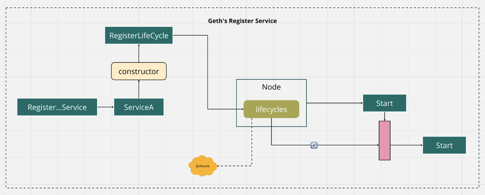

# Geth's Register Service Pattern

## Registration Mechanism
- Services are registered as implementations of a `Lifecycle` interface, which includes `Start()` and `Stop()` methods.
- The `RegisterLifecycle()` method directly adds a `Lifecycle` instance to an internal slice, meaning the service must be created before being registered.
- This makes Geth's `Node` more straightforward for scenarios where services do not require complex dependency resolution during registration.

## Service Context and Dependency Management
- Does not use an explicit `ServiceContext`. Services are registered directly, with no built-in dependency resolution.
- While simpler, this approach can lead to limitations if services need to access each other. Dependencies must be handled externally or through direct references passed at creation.

## Lifecycle Management
- `Lifecycle` management is handled through an array of `Lifecycle` instances. The Node's `Start()` method loops through and starts each lifecycle component.
- The Node's `stopServices()` method stops services in reverse order, supporting a controlled shutdown.
- This design is suitable for basic service orchestration where services are independently managed and do not depend on a common context.

## Service Creation Timing
- Services must be created and configured before registration.
- The `RegisterLifecycle()` method expects a fully formed service instance, which simplifies service initialization but may limit flexibility in handling service interdependencies.

## Flexibility and Modularity
- Simpler and more direct, focusing primarily on the `Lifecycle` interface for service management.
- Suitable for simpler architectures where services operate independently or handle their dependencies outside the Geth's `Node`.

## Conclusion
Choose Geth's Register Service Pattern for simpler cases where lifecycle management (start/stop) is sufficient and services don’t need to access one another through a shared context.