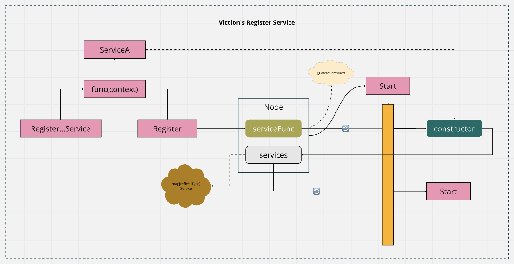

# Viction's Register Service Pattern

## Registration Mechanism
- Services are registered using `ServiceConstructor`, a function signature that accepts a `ServiceContext` and returns a Service instance and an error.
- Services are only created when the `Start()` method of the Viction's `Node` is called. This deferred instantiation allows all constructors to be registered before any services are started.
- The `Register()` method appends these constructors to the `serviceFuncs` slice, ensuring a modular approach to service registration.

## Service Context and Dependency Management
- The `ServiceContext` struct allows each service to access previously registered services, promoting dependency management and interaction between services.
- When a service constructor is called, the `ServiceContext` is populated with existing services. This enables services to interact or depend on one another.
- This design provides more modularity and flexibility for systems that require services to access shared states or cross-communicate.

## Lifecycle Management
- Services are started in sequence during the Node's `Start()` method, which calls the `Start()` method on each service after they are constructed.
- The Node's `Stop()` method iterates through the registered services and calls their `Stop()` method to shut them down gracefully.
- This approach ensures that all services are constructed, started, and managed by Viction's `Node` in a consistent manner, allowing for easier lifecycle control.

## Service Creation Timing
- Service creation is deferred until Node's `Start()` is called. This means services are not initialized during registration but rather during the node’s startup.
- This allows for all dependencies and configurations to be finalized before services begin their lifecycle.

## Flexibility and Modularity
- More flexible due to the `ServiceContext`, which enables services to interact with and depend on one another.
- Suitable for systems with complex initialization logic or cross-service dependencies.
- The additional context struct introduces more modularity, allowing service constructors to dynamically manage their dependencies.

## Conclusion
Choose Viction's Register Service Pattern if you need a more modular and flexible system where services have interdependencies and benefit from a context-driven approach for shared state and dependency injection.