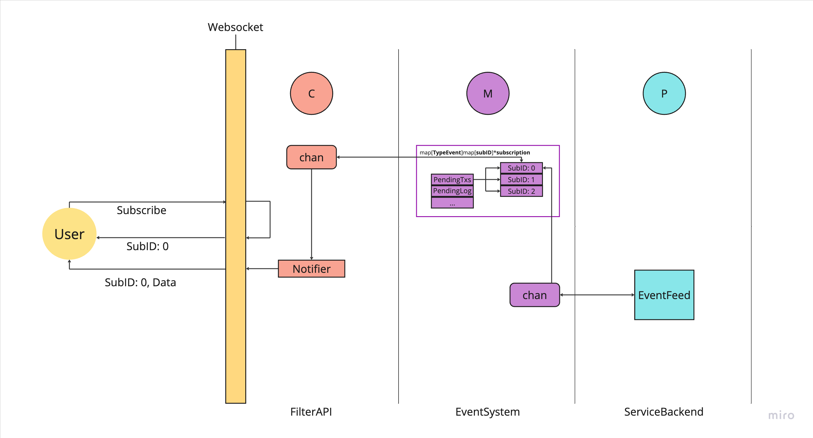

# Event Subscription

The event subscription pattern is an architectural design that allows decoupled communication between components within a system. In this setup, an event producer generates events while consumers register their interest to receive notifications when these events occur. An event system acts as an intermediary, managing subscriptions and facilitating the flow of events from producers to consumers.

## How to run test
```bash
$ cd subscription/
$ go test -v
```

## Overall Diagram
The diagram below illustrates the event subscription system architecture, showing the relationships between the producer, the event system, and consumers.


## Concepts
### Producer
A component that generates or emits events. The producer is decoupled from the consumers and does not need to know which components are receiving the events.

### Consumer
A component that subscribes to receive specific types of events. The consumer processes the events as they arrive and acts upon them as needed.

### Event System
The intermediary that manages subscriptions, dispatches events, and ensures they reach the appropriate consumers.

